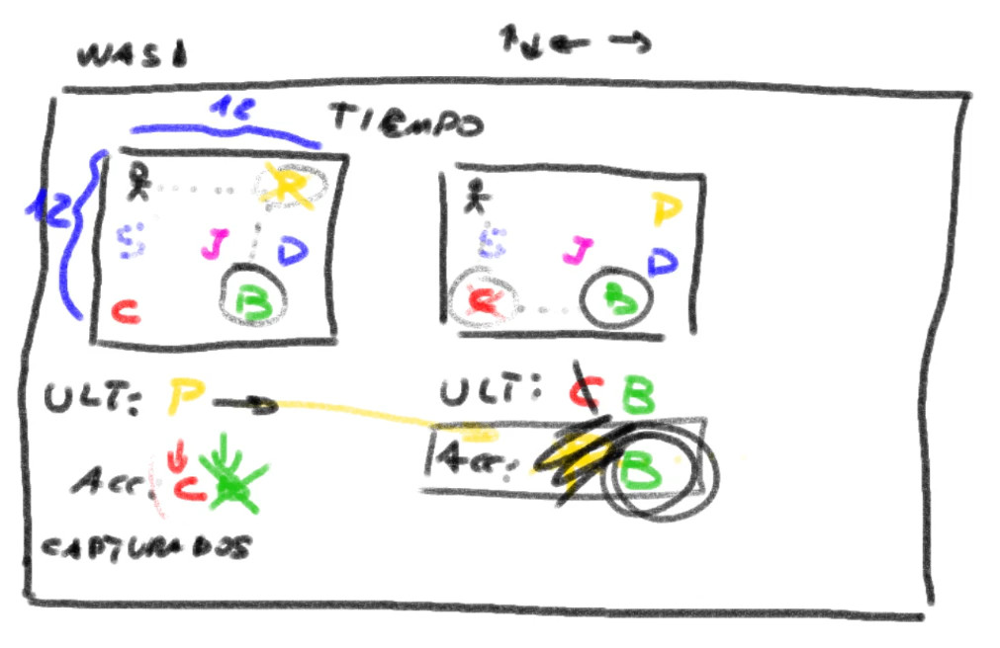

# TP2

Se pide implementar un juego simple por consola jugable por 2 jugadores a la vez **reutilizando los TDAs implementados durante la cursada**.

Para esta oportunidad se proveen los archivos presentes dentro del directorio *extra* que implementan una funcionalidad muy básica (y un tanto primitiva) para manejar el loop del juego. Dado que cierta parte de esta funcionalidad no es **C99** estándar, se provee un *makefile* para facilitar la compilación.

## Funcionalidad pedida

Para iniciar el juego, debe invocarse tp2 con el archivo de pokedex a utilizar. Al ejecutarse el tp2, debe presentarse al usuario un menú con las siguientes opciones:

  - (J) Jugar: Inicia el juego con una semilla aleatoria
  - (S) Jugar con semilla: Se pide al usuario ingresar una semilla antes de iniciar el juego
  - (B) Buscar: Se muestra un submenú con las siguientes opciones
    - (N) Buscar por nombre: Pide al usuario un nombre y busca en la pokedex los pokemones con ese nombre
    - (I) Buscar por ID: Pide al usuario un id y busca en la pokedex los pokemones con ese id
    - (A) Menú anterior: Vuelve al menú anterior
  - (M) Mostrar: Se muestra un submenú con las siguientes opciones
    - (N) Mostrar por nombre: Muestra los pokemones de la pokedex ordenados por nombre
    - (I) Buscar por ID: Muestra los pokemones de la pokedex ordenados por id
    - (A) Menú anterior: Vuelve al menú anterior
  - (Q) Sale del juego

## Descripción del juego

Se presentan 2 zonas de juego separadas de **12x12** (una para cada jugador). Utilizando las teclas [**WASD**] y [**↑←↓→**], los jugadores 1 y 2 pueden desplazarse por la zona de juego. En la zona de juego siempre debe haber presentes 4 pokemones. Cuando un jugador se mueve al mismo casillero en el que se encuentra presente un pokemon, dicho entrenador captura el pokemon. En ese momento suceden 4 cosas:

  - El jugador agrega el pokemon al listado de pokemones capturados.
  - Si el pokemon tiene el mismo tipo que el pokemon de la próxima combinación el jugador gana un punto y se restaura el pokemon de combinación anterior.
  - El jugador oponente pierde un punto y debe agregar el pokemon capturado como próxima combinación.
  - Se agrega un nuevo pokemon a la zona de juego del jugador.

Tener en cuenta que:

  - Siempre deben existir 4 pokemon en cada zona de juego
  - Es posible que en un mismo casillero convivan 2 o mas pokemones
  - Existe un límite de tiempo de un minuto para el juego
  - Si se agrega un pokemon a la zona de juego un jugador, cuando el jugador oponente necesite un nuevo pokemon debe agregarse exactamente el mismo pokemon en la misma posición.
  - Cada jugador comienza con 10 puntos.
  - Inicialmente la combinación de cada jugador es vacía.
  - Un jugador pierde cuando se queda sin puntos.

Se recomienda que junto a las zonas de juego se muestre información relevante para los jugadores (tiempo restante, puntos, próximo pokemon de combinación, etc).

## Consideraciones extra

Para este trabajo hay 3 cosas importantes:

  - Que el alumno **pueda demostrar que comprende cómo funcionan y en qué momento conviene utilizar cada uno de los TDA implementados durante la materia**.
  - La presentación y usabilidad del juego.
  - La presentación y legibilidad del código.
  - No se permite la utilización de bibliotecas externas (SDL, ncurses, sarasa). Si alguno quiere hacerlo puede hacerlo de forma optativa, es obligatorio que el trabajo entregado funcione sin requerimientos externos.
  - El archivo *tp2.c* se presenta solo a modo de ejemplo de un gameloop simple (fue implementado en clase). Se recomienda borrar todo y empezar de 0.

  Se propone prestar atención a la presentación y se recomienda implementar todos los TDA que crea necesarios para mejorar la presentación tanto del juego final como del código. Como mínimo, se pide implementar un TDA Menú. Dicho TDA debe ser reutilizable para cualquier TP futuro (no solo para este).

  Tener en cuenta que por mas que en esta oportunidad, al no existir una interfaz común a implementar, el bot de entregas no correrá pruebas automatizadas para probar el código. Sí se corren las pruebas del usuario y es importante que se pruebe la funcionalidad implementada.

## Parte teórica

Explicar los siguientes puntos (no necesariamente en orden, pero por favor usando diagramas):

   - ¿Qué TDAs fueron utilizados para implementar las funcionalidades pedidas? ¿Por qué fue elegido ese TDA y no otro?
   - Explicar el TDA menú. Justifique las operaciones incluídas en el TDA.
   - Explicar cualquier otro TDA implementado.
   - Explique qué dificultades encontró al implementar el TP2 y cómo pudo solucionarlas.
